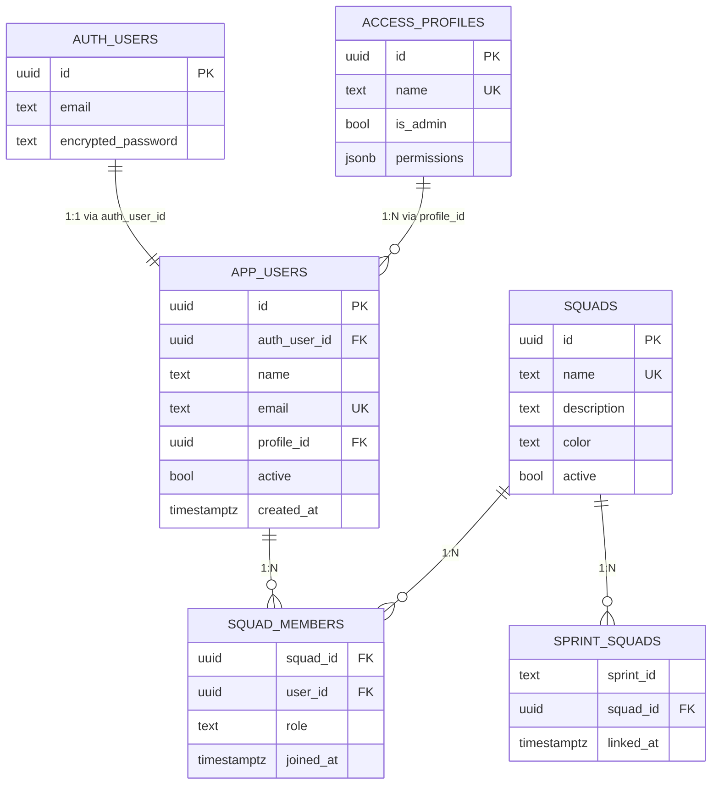

# Template de Documentação de Schema — ToStatos

Use este template ao documentar novas tabelas ou atualizar a documentação existente.

---

# Schema do Banco de Dados — ToStatos
> Atualizado em: [data]
> DBA: dba-expert
> PostgreSQL 15 via Supabase managed

---

## Índice de tabelas

| Tabela | Propósito | RLS | Linhas aprox. |
|---|---|---|---|
| `access_profiles` | Perfis de acesso com permissões JSONB | ✅ | < 20 |
| `squads` | Times de QA | ✅ | < 100 |
| `app_users` | Usuários da aplicação (referencia auth.users) | ✅ | < 500 |
| `squad_members` | N:N entre usuários e squads | ✅ | < 2.000 |
| `sprint_squads` | Vínculo entre sprints JSONB e squads | ✅ | < 10.000 |

---

## Tabela: `access_profiles`

**Propósito:** Define os perfis de acesso disponíveis no sistema. Cada usuário tem exatamente um perfil. Os perfis controlam o que o usuário pode ver e fazer via campo `permissions` (JSONB).

**Cardinalidade:** Baixa (< 20 registros). Não cresce com o uso do sistema.

| Coluna | Tipo | Nulo | Default | Descrição |
|---|---|---|---|---|
| `id` | `uuid` | Não | `gen_random_uuid()` | PK |
| `name` | `text` | Não | — | Nome único do perfil. Ex: "Admin", "QA Lead" |
| `description` | `text` | Sim | — | Descrição para exibição na UI |
| `is_admin` | `boolean` | Não | `false` | Se `true`, bypassa verificações de permissão específica |
| `permissions` | `jsonb` | Não | `'{}'` | Mapa de permissões booleanas. Ver estrutura abaixo |
| `created_at` | `timestamptz` | Não | `NOW()` | |
| `updated_at` | `timestamptz` | Não | `NOW()` | Atualizado via trigger |

**Estrutura do campo `permissions`:**
```json
{
  "create_sprint":    true,
  "edit_sprint":      true,
  "delete_sprint":    false,
  "view_all_squads":  true,
  "manage_users":     false,
  "manage_squads":    false,
  "manage_profiles":  false
}
```

**Índices:** nenhum (tabela pequena, leitura por PK é suficiente)

**RLS:** Leitura para qualquer autenticado. Escrita restrita a admins.

**Constraints:** `name` UNIQUE — não podem existir dois perfis com o mesmo nome.

**Decisões de design:**
- JSONB para permissões permite adicionar novas permissões sem migration de schema
- `is_admin` separado do JSONB para permitir queries SQL diretas sem operador JSONB
- Perfis padrão inseridos na migration inicial — não dependem de seed manual

---

## Tabela: `app_users`

**Propósito:** Registro de usuários da aplicação. Complementa o `auth.users` do Supabase Auth com dados de negócio (nome de exibição, perfil, squads).

**Cardinalidade:** Cresce com onboarding de usuários. Esperado < 500 registros.

| Coluna | Tipo | Nulo | Default | Descrição |
|---|---|---|---|---|
| `id` | `uuid` | Não | `gen_random_uuid()` | PK interno da aplicação |
| `auth_user_id` | `uuid` | Não | — | FK para `auth.users.id` do Supabase Auth. UNIQUE |
| `name` | `text` | Não | — | Nome de exibição |
| `email` | `text` | Não | — | Email. Sincronizado com `auth.users.email`. UNIQUE |
| `profile_id` | `uuid` | Sim | — | FK para `access_profiles.id`. NULL = sem acesso |
| `active` | `boolean` | Não | `true` | Usuários inativos são bloqueados no middleware de auth |
| `created_at` | `timestamptz` | Não | `NOW()` | |
| `updated_at` | `timestamptz` | Não | `NOW()` | |

**View derivada: `app_users_view`**
Inclui `avatar_initials`, `profile_name`, `profile_is_admin`, `profile_permissions`.
Usar esta view nos joins de auth para evitar múltiplos JOINs nos controllers.

**Índices:**
- `idx_app_users_auth` em `auth_user_id` — usado no middleware de autenticação (hot path)
- `idx_app_users_profile` em `profile_id` — usado em queries de permissão

**RLS:** Usuário vê só o próprio registro. Admin vê todos. Escrita só por admin.

**Decisões de design:**
- `auth_user_id` mantém o vínculo com o Supabase Auth sem duplicar a tabela de auth
- `active = false` não apaga o registro — preserva histórico e audits
- Email duplicado intencionalmente (em `auth.users` e aqui) para facilitar queries sem JOIN

**Relacionamentos:**
```
app_users ──── profile_id ──→ access_profiles.id   (N:1)
app_users ←─── user_id ──────  squad_members        (1:N)
auth.users ←── auth_user_id ── app_users            (1:1)
```

---

## Tabela: `squads`

**Propósito:** Times de QA cadastrados no sistema. Cada squad pode ter múltiplos membros e estar vinculado a múltiplas sprints.

| Coluna | Tipo | Nulo | Default | Descrição |
|---|---|---|---|---|
| `id` | `uuid` | Não | `gen_random_uuid()` | PK |
| `name` | `text` | Não | — | Nome único. Ex: "Checkout", "Pagamentos" |
| `description` | `text` | Sim | — | Descrição da responsabilidade do squad |
| `color` | `text` | Não | `'#185FA5'` | Cor em hex para identificação visual. Regex: `^#[0-9A-Fa-f]{6}$` |
| `active` | `boolean` | Não | `true` | Squads inativos não aparecem nos filtros de sprint |
| `created_at` | `timestamptz` | Não | `NOW()` | |
| `updated_at` | `timestamptz` | Não | `NOW()` | |

**Índices:** nenhum além da PK (tabela pequena)

**RLS:** Leitura para qualquer autenticado (squads ativos). Escrita restrita a admins/manage_squads.

---

## Tabela: `squad_members`

**Propósito:** Relacionamento N:N entre usuários e squads. Um usuário pode pertencer a múltiplos squads.

| Coluna | Tipo | Nulo | Default | Descrição |
|---|---|---|---|---|
| `squad_id` | `uuid` | Não | — | FK → `squads.id`. ON DELETE CASCADE |
| `user_id` | `uuid` | Não | — | FK → `app_users.id`. ON DELETE CASCADE |
| `role` | `text` | Não | `'member'` | `'lead'` ou `'member'` |
| `joined_at` | `timestamptz` | Não | `NOW()` | |

**PK composta:** `(squad_id, user_id)`

**Índices:**
- `idx_squad_members_user` em `user_id` — usado para "quais squads sou membro?"
- `idx_squad_members_squad` em `squad_id` — usado para "quem está neste squad?"

**ON DELETE CASCADE:** remoção de squad remove todos os membros. Remoção de usuário remove todas as associações.

**RLS:** Membro vê só squads onde está. Admin vê todos.

---

## Tabela: `sprint_squads`

**Propósito:** Vínculo entre sprints (identificadas por string ID do localStorage) e squads. Permite filtrar quais sprints um usuário pode ver baseado nos seus squads.

| Coluna | Tipo | Nulo | Default | Descrição |
|---|---|---|---|---|
| `sprint_id` | `text` | Não | — | ID da sprint. Formato: `sprint_{timestamp}`. Sem FK (sprint vive no JSONB/localStorage) |
| `squad_id` | `uuid` | Não | — | FK → `squads.id`. ON DELETE CASCADE |
| `linked_at` | `timestamptz` | Não | `NOW()` | |

**PK composta:** `(sprint_id, squad_id)`

**Decisão de design — `sprint_id` como TEXT sem FK:**
As sprints são armazenadas em JSONB/localStorage, não em tabela relacional. A FK para o banco não é possível sem migrar as sprints para o banco. A integridade referencial é garantida pela aplicação (ao deletar sprint, deletar os vínculos via `DELETE FROM sprint_squads WHERE sprint_id = ?`).

**Índices:**
- `idx_sprint_squads_sprint` em `sprint_id` — "quais squads estão nessa sprint?"
- `idx_sprint_squads_squad` em `squad_id` — "quais sprints esse squad tem acesso?"

---

## Diagrama de Relacionamentos (Mermaid)



---

## Decisões de Cascade — Referência Rápida

| Relação | ON DELETE | Motivo |
|---|---|---|
| `app_users.auth_user_id → auth.users` | CASCADE | Usuário deletado no Auth deve sair da aplicação |
| `app_users.profile_id → access_profiles` | SET NULL | Deletar perfil não deve deletar o usuário — cai para "sem acesso" |
| `squad_members.squad_id → squads` | CASCADE | Squad deletado remove todos os membros |
| `squad_members.user_id → app_users` | CASCADE | Usuário deletado sai de todos os squads |
| `sprint_squads.squad_id → squads` | CASCADE | Squad deletado desvincula suas sprints |

---

## Alertas e Monitoramento

### Queries de saúde (executar mensalmente)

```sql
-- 1. Tabelas com dead tuples acima de 10% (candidatas a VACUUM manual)
SELECT relname, n_live_tup, n_dead_tup,
  ROUND(n_dead_tup::numeric / NULLIF(n_live_tup + n_dead_tup, 0) * 100, 1) AS pct_dead
FROM pg_stat_user_tables
WHERE n_dead_tup > 100
ORDER BY pct_dead DESC;

-- 2. Índices não usados (candidatos a DROP se > 30 dias sem uso)
SELECT schemaname, tablename, indexname,
  pg_size_pretty(pg_relation_size(indexrelid)) AS size,
  idx_scan AS scans
FROM pg_stat_user_indexes
WHERE idx_scan = 0 AND schemaname = 'public'
ORDER BY pg_relation_size(indexrelid) DESC;

-- 3. Crescimento do JSONB (se aplicável)
-- SELECT AVG(pg_column_size(state)), MAX(pg_column_size(state)) FROM dashboard_states;
```
