# Diagrama Entidade-Relacionamento (DER) — ToStatos

> Gerado em: 2026-04-05 | Autor: DBA Expert
> Schema: `public` | PostgreSQL 15 via Supabase

---

## DER Completo (Mermaid)

```mermaid
erDiagram
    AUTH_USERS {
        uuid id PK
        text email
        jsonb raw_user_meta_data
    }

    PROFILES {
        uuid id PK "FK auth.users ON DELETE CASCADE"
        text email
        text display_name
        text global_role "admin | gerente | user"
        bool active "default true"
        timestamptz created_at
    }

    SQUADS {
        uuid id PK "gen_random_uuid()"
        text name
        text description
        text color "default #185FA5"
        uuid created_by FK "auth.users ON DELETE SET NULL"
        bool archived "default false"
        timestamptz created_at
    }

    SQUAD_MEMBERS {
        uuid id PK "gen_random_uuid()"
        uuid squad_id FK "squads ON DELETE CASCADE"
        uuid user_id FK "auth.users ON DELETE CASCADE"
        squad_role role "qa_lead | qa | stakeholder"
        jsonb permissions "21 flags create/edit/delete"
        timestamptz created_at
    }

    PERMISSION_PROFILES {
        uuid id PK "gen_random_uuid()"
        text name
        text description
        jsonb permissions "21 flags create/edit/delete"
        bool is_system "default false"
        uuid created_by FK "auth.users ON DELETE SET NULL"
        timestamptz created_at
    }

    SPRINTS {
        text id PK
        jsonb data "SprintState completo"
        text status "ativa | concluida"
        uuid squad_id FK "squads ON DELETE SET NULL, NOT NULL"
        timestamptz updated_at "auto-trigger"
    }

    STATUS_REPORTS {
        text id PK
        jsonb data "StatusReportState completo"
        uuid squad_id FK "squads ON DELETE SET NULL, NOT NULL"
        text status "active | concluded"
        timestamptz updated_at "auto-trigger"
    }

    RELEASES {
        text id PK
        jsonb data "Release completo"
        text status "9 valores validos"
        text version
        date production_date
        timestamptz updated_at "auto-trigger"
    }

    AUDIT_LOGS {
        uuid id PK "gen_random_uuid()"
        uuid user_id FK "auth.users ON DELETE SET NULL"
        text user_email
        text resource_type "sprint | status_report | squad"
        text resource_id
        text action "create | update | delete"
        jsonb changes "campo: old/new"
        timestamptz created_at
    }

    SQUAD_CONFIG {
        uuid id PK "gen_random_uuid()"
        uuid squad_id FK "squads ON DELETE CASCADE, UNIQUE"
        jsonb data "configuracoes do squad"
        timestamptz updated_at "auto-trigger"
    }

    DASHBOARD_STATES {
        text project_key PK
        jsonb payload "estado do dashboard"
        timestamptz updated_at "auto-trigger"
    }

    AUTH_USERS ||--|| PROFILES : "trigger handle_new_user"
    AUTH_USERS ||--o{ SQUAD_MEMBERS : "user_id"
    AUTH_USERS ||--o{ AUDIT_LOGS : "user_id"
    AUTH_USERS ||--o{ SQUADS : "created_by"
    AUTH_USERS ||--o{ PERMISSION_PROFILES : "created_by"
    PROFILES ||--o{ SQUAD_MEMBERS : "user_id (dual FK)"
    SQUADS ||--o{ SQUAD_MEMBERS : "squad_id"
    SQUADS ||--o{ SPRINTS : "squad_id"
    SQUADS ||--o{ STATUS_REPORTS : "squad_id"
    SQUADS ||--|| SQUAD_CONFIG : "squad_id (1:1)"
```

---

## Legenda de Relacionamentos

| Origem | Destino | Cardinalidade | ON DELETE | Observacao |
|---|---|---|---|---|
| `profiles.id` | `auth.users.id` | 1:1 | CASCADE | Trigger auto-cria profile |
| `squads.created_by` | `auth.users.id` | N:1 | SET NULL | Criador do squad |
| `squad_members.squad_id` | `squads.id` | N:1 | CASCADE | Membro pertence ao squad |
| `squad_members.user_id` | `auth.users.id` | N:1 | CASCADE | FK principal |
| `squad_members.user_id` | `profiles.id` | N:1 | CASCADE | FK auxiliar (PostgREST join) |
| `sprints.squad_id` | `squads.id` | N:1 | SET NULL | Sprint pertence ao squad |
| `status_reports.squad_id` | `squads.id` | N:1 | SET NULL | Report pertence ao squad |
| `squad_config.squad_id` | `squads.id` | 1:1 | CASCADE | Config unica por squad |
| `audit_logs.user_id` | `auth.users.id` | N:1 | SET NULL | Quem executou a acao |
| `permission_profiles.created_by` | `auth.users.id` | N:1 | SET NULL | Quem criou o perfil |

---

## Notas

- **`releases`** e **`dashboard_states`** nao possuem FK para squads — releases sao globais, dashboard_states sao por project_key
- **`squad_members`** tem dual FK para `auth.users` e `profiles` — a FK para profiles existe para habilitar joins automaticos no PostgREST
- Todas as tabelas possuem `ENABLE ROW LEVEL SECURITY` + `FORCE ROW LEVEL SECURITY`
- Tabelas com `updated_at` possuem trigger `set_updated_at()` automatico
